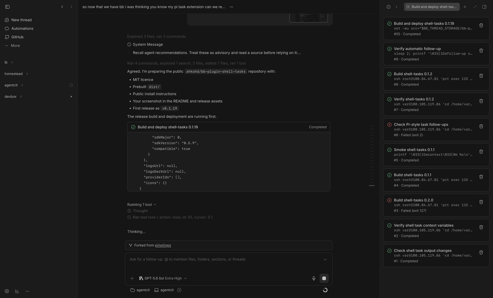

# Shell tasks for BB

Lets your BB agents run long-lived shell commands without blocking a turn.



Shell tasks adds a provider-independent `task` tool to [BB](https://github.com/get-bb/bb). Commands run on the thread's execution machine, survive plugin reloads and report completion back to the agent.

## Install

Install the latest compatible `0.1.x` release:

```sh
bb plugin install git:https://github.com/ahkohd/bb-plugin-shell-tasks.git@^0.1.0
```

The plugin works with supported BB providers, including Pi.

To nudge agents to choose Shell tasks over a provider's built-in background-task runner:

```sh
bb plugin config shell-tasks set preferOverNativeBackgroundTasks true
bb plugin reload shell-tasks
```

The preference applies when the next provider session is assembled. It adds agent instructions; it does not disable provider-native tools. Agents can still use the provider runner when `task` is unavailable or a command needs an interactive terminal.

### Provider notes

Claude Code users can disable its native background-task facility through BB's machine environment:

```sh
printf '1\n' | bb machine env set CLAUDE_CODE_DISABLE_BACKGROUND_TASKS
```

This setting applies across connected machines and BB projects. Add `--project <project-id>` to scope it to one project. Start a new Claude thread afterwards. The variable disables all Claude Code background tasks, including background Bash commands and subagents; Shell tasks does not set it automatically.

## What you get

The plugin registers these `task` actions:

- `start(command, title?)`
- `list`
- `read(id, cursor?)`
- `tail(id, lines?)`
- `stop(id)`
- `clear(id)`

Tasks appear as native tool rows, in a per-thread Shell tasks panel and as optional `::shell-task{id="1"}` message cards. Successful and failed tasks can wake the agent with one durable, batched follow-up.

## How it works

Commands run through `/bin/sh` in the thread's environment directory. They inherit machine environment variables and receive `BB_THREAD_ID`, `BB_PROJECT_ID`, `BB_ENVIRONMENT_ID` and `BB_THREAD_STORAGE`. Standard output and standard error share one ordered log.

`start` returns immediately with `status: "running"`. Its `pid` is the detached supervisor and process-group leader. Running tasks and result capture survive plugin worker and server reloads. Use `stop` rather than signalling the process directly.

`read` uses byte cursors and returns complete lines. A line that reaches the 50 KB limit is returned in UTF-8-safe chunks so the cursor keeps advancing. `tail` is a live snapshot and can include an unfinished current line. ANSI control sequences are removed from both.

A full final read, complete tail or clear acknowledges completion and suppresses its follow-up. `list` and task cards do not. Do not wait for a follow-up after acknowledging completion.

## Limits

- Reads return at most 50 KB or 200 lines.
- Tails default to 50 lines and accept 1 to 200.
- Stop sends `SIGTERM`, waits 5 seconds, then sends `SIGKILL` to the process group.
- Clear removes a finished task and deletes its log.
- The SDK has no atomic send-and-record operation, so an interruption at that boundary can produce a duplicate follow-up.

## Development

```sh
npm install
npm test
npm run check
bb plugin types --check
bb plugin build
```

Install or reload a development checkout:

```sh
bb plugin install .
bb plugin reload shell-tasks
```

## License

[MIT](LICENSE)
